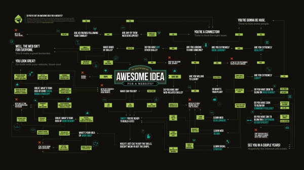

<!-- Header -->
<!--<h3 align="center">Project Title</h3>-->
<!--<h2 align="center">Project Description</h2>-->

	'
	 
	<a href="https://github.com/JamesLaFritz/GraphViewBehaviorTree/issues">Report Bug</a>
        ·
        <a href="https://github.com/JamesLaFritz/GraphViewBehaviorTree/issues">Request Feature</a>

<!-- PROJECT SHIELDS -->

  
  
  
  
  

<!-- Links -->

  
  
   
   

<!-- PROJECT LOGO -->

  

<!-- TABLE OF CONTENTS -->

  
<h2 style="display: inline-block">Table of Contents</h2>

  <ol>
    <li>
      <a href="#about-the-project">About The Project</a>
        <ul>
            <li> Node Types </li>
            <ul>
                <li><a href="#decorator-node">Decorator Node</a></li>
            </ul>
            <ul>
                <li><a href="#composite-node">Composite Node</a></li>
            </ul>
	        <ul>
                <li><a href="#action-node">Action Node</a></li>
            </ul>
        </ul>
	    <ul>
            <li><a href="#built-with">Built With</a></li>
        </ul>
        <ul>
            <li><a href="#articles">Articles</a></li>
        </ul>
    </li>
    <li><a href="#license">License</a></li>
    <li><a href="#acknowledgements">Acknowledgements</a></li>
  </ol>

<!-- ABOUT THE PROJECT -->
## About The Project

I had code on sitting around on my hard drive for a Behavior Tree Editor That inspired me to create a bBehavior Tree Editor and write Articles about Behavior Tree and Using the Unity Editor UI Builder.
It has been [Pointed Out](https://github.com/JamesLaFritz/GraphViewBehaviorTree/issues/1) to me very polite and professional that this code is actually from the KIWI Coder.

Behavior Tree using UI Builder, GraphView, and Scriptable Objects in Unity 2021.3

Behavior Tree is an execution tree (uses the [Strategy pattern](https://blog.devgenius.io/strategy-pattern-in-unity-b82065aaa969)) and always starts with a Root Node. This will be so
that the behavior tree knows where to start. Root Node has only one child. Now there are 3 basic main type of nodes
Decorator, Composite Node and Action Node.
Each Node can return one of three states Running, Success, or Failure.
All nodes will be saved in Unity as Scriptable Objects. A Behavior tree will be a Scriptable Object containing all the
Nodes in it.

#### Decorator Node
* Has one child and is capable of augmenting the return state of it's child. This uses the [Decorator
pattern](https://blog.devgenius.io/the-decorator-pattern-in-unity-6791ab10b64).

#### Composite Node
* Has a list of children and is the control flow of the behavior tree like switch statements and for
loops. There are 2 types Composite Nodes the Selector and Sequence. This uses the [Composite pattern](https://blog.devgenius.io/composite-pattern-in-unity-fc90e60c946f).

#### Action Node
* The Leaf of the tree, has no children, and is where all of the logic gets implemented.

### Built With

* 

<!-- Articles -->
### Articles

<!-- ROADMAP -->
## Roadmap

See the [open issues](https://github.com/JamesLaFritz/GraphViewBehaviorTree/issues) for a list of proposed features (and known issues).

<!-- LICENSE -->
## License

Distributed under the MIT License. See `LICENSE` for more information.

<!-- ACKNOWLEDGEMENTS -->
## Acknowledgements

<!--
Repo Card Exclusive Options:
    show_owner - Show the repo's owner name (boolean)

Common Options:
    title_color - Card's title color (hex color)
    text_color - Body text color (hex color)
    icon_color - Icons color if available (hex color)
    border_color - Card's border color (hex color). (Does not apply when hide_border is enabled)
    bg_color - Card's background color (hex color) or a gradient in the form of angle,start,end
    hide_border - Hides the card's border (boolean)
    theme - name of the theme, choose from all available themes
    cache_seconds - set the cache header manually (min: 1800, max: 86400)
    locale - set the language in the card (e.g. cn, de, es, etc.)
    border_radius - Corner rounding on the card_
Gradient in bg_color

You can provide multiple comma-separated values in bg_color option to render a gradient, the format of the gradient is :-

&bg_color=DEG,COLOR1,COLOR2,COLOR3...COLOR10

Avaliable Repo Card Themes
default_repocard
dark
radical
merko
gruvbox
tokyonight
onedark
cobalt
synthwave
highcontrast
dracula
prussian
monokai
vue
vue-dark
shades-of-purple
nightowl
buefy
blue-green
algolia
great-gatsby
darcula
bear
solarized-dark
solarized-light
chartreuse-dark
nord
gotham
material-palenight
graywhite
vision-friendly-dark
ayu-mirage
midnight-purple
calm
flag-india
omni
react
jolly
maroongold
yeblu
blueberry
slateorange
kacho_ga
outrun
-->
